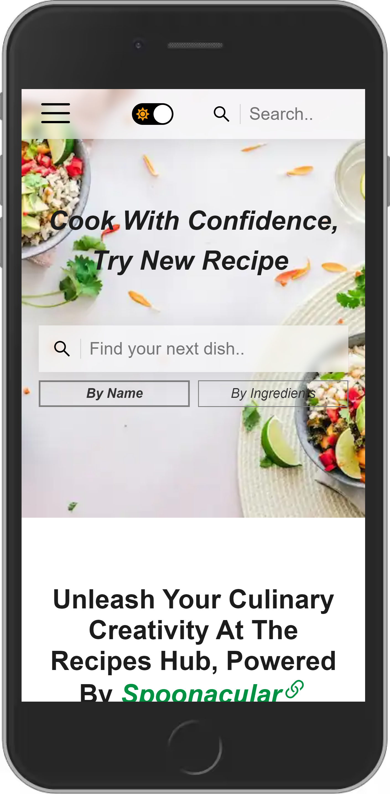

# The Recipes Hub, Powered By Spoonacular API

Welcome to the Recipes Hub, where we believe that cooking is an art form and a means of self-expression. Our website is powered by the Spoonacular API, providing you with access to a vast collection of the latest and greatest recipes from around the world. Whether you're a seasoned chef or just starting out, our recipes will inspire you to get creative in the kitchen and try something new. From classic dishes to innovative creations, you'll find everything you need to take your cooking to the next level. With the Spoonacular API, we bring you the best of the culinary world right at your fingertips. So why wait? Join us on this culinary journey and unleash your creativity today!

[Search for a recipe here 🍜](https://the-recipehub.netlify.app/ "The Recipe Hub") 

## Features

- Single Page Web Application - React
- Light/dark mode toggle
- Recipes search by name
- Recipes search by ingredients
- Recipes search by type
- Searching for a similar recipe
- Saving your favorite recipes in the Local Storage
- Printing your favorite recipes
- Search Engine Optimization (SEO)
- Styled with Styled Components
- RWD

  
  
  

  
    

